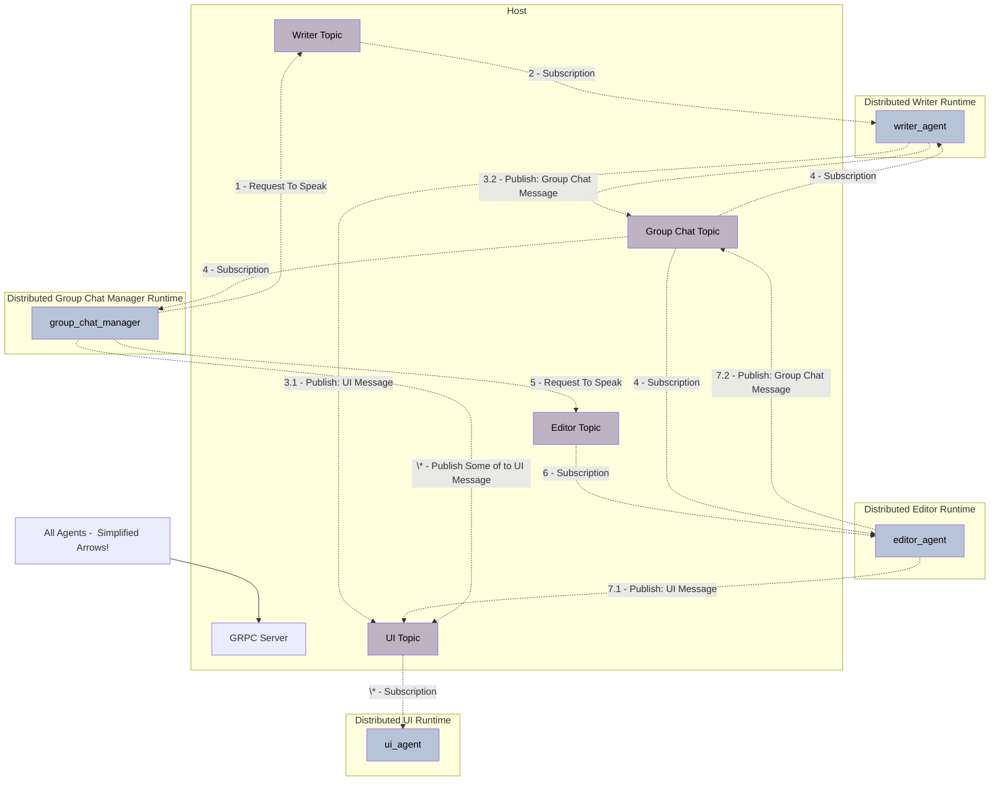

# **分布式群聊示例**

本示例演示了如何使用 [GrpcWorkerAgentRuntimeHost](../../src/autogen_core/application/_worker_runtime_host.py) 运行 gRPC 服务器，并使用 [GrpcWorkerAgentRuntime](../../src/autogen_core/application/_worker_runtime.py) 实例化三个分布式运行时。这些运行时作为主机连接到 gRPC 服务器，并促进一个轮询式的分布式群聊。本示例利用 [Azure OpenAI 服务](https://azure.microsoft.com/en-us/products/ai-services/openai-service) 来实现编写器（writer）和编辑（editor）LLM 智能体。智能体被指示提供简洁的答案，因为本示例的主要目标是展示分布式运行时，而不是智能体响应的质量。

## **功能说明**

本示例的核心是展示 AutoGen 的分布式运行时能力，通过 gRPC 服务器协调多个独立运行的智能体。

### **系统架构**

系统由以下主要组件组成：

*   **gRPC 服务器 (Host)**: 使用 `GrpcWorkerAgentRuntimeHost` 运行，作为所有分布式智能体的中央协调器，监听智能体连接。
*   **分布式运行时 (Runtimes)**: 使用 `GrpcWorkerAgentRuntime` 实例化，每个智能体都在自己的独立运行时中运行，并连接到 gRPC 服务器。
*   **智能体**:
    *   **编写器智能体 (Writer Agent)**: 负责生成文本内容。
    *   **编辑智能体 (Editor Agent)**: 负责审查和修改编写器智能体生成的内容。
    *   **UI 智能体 (UI Agent)**: 负责启动 Chainlit 应用，监听 UI 主题中的消息流并在用户界面中显示。
    *   **群聊管理器智能体 (Group Chat Manager Agent)**: 负责管理群聊的流程，向其他智能体发送发言请求，并接收消息。

### **工作流程**

本示例的通用流程如下：

1.  UI 智能体启动 UI 应用，监听 UI 主题中的消息流并在 UI 中显示。
2.  群聊管理器智能体代表用户向编写器智能体发送一个 `RequestToSpeak` 请求。
3.  编写器智能体在群聊主题中写入一个简短的句子。
4.  编辑智能体在群聊主题中接收到消息并更新其内存。
5.  群聊管理器智能体同时接收到编写器发送到群聊中的消息，并向下一个参与者（编辑智能体）发送一个 `RequestToSpeak` 消息。
6.  编辑智能体将其反馈发送到群聊主题。
7.  编写器智能体接收到反馈并更新其内存。
8.  群聊管理器智能体同时接收到消息，并从步骤 1 开始重复循环。

以下是本示例中开发的系统示意图：



## **安装**

### **1. 设置 Python 环境**

1.  创建一个虚拟环境并激活它（例如：`python3.12 -m venv .venv && source .venv/bin/activate`）。
2.  安装依赖项：

    ```bash
    pip install "autogen-ext[openai,azure,chainlit,rich]" "pyyaml"
    ```

### **2. 通用配置**

在 `config.yaml` 文件中，您可以配置 `client_config` 部分以将代码连接到 Azure OpenAI 服务。

### **3. 身份验证**

推荐的身份验证方法是通过 Azure Active Directory (AAD)，如[模型客户端 - Azure AI](https://microsoft.github.io/autogen/dev/user-guide/core-user-guide/framework/model-clients.html#azure-openai) 中所述。本示例支持 AAD 方法（推荐）以及在 `config.yaml` 文件中提供 `api_key`。

## **运行**

### **通过脚本运行**

`run.sh` 文件提供了使用 [tmux](https://github.com/tmux/tmux/wiki) 运行主机和智能体的命令。此方法的步骤如下：

1.  安装 tmux。
2.  激活 Python 环境：`source .venv/bin/activate`。
3.  运行 bash 脚本：`./run.sh`。

以下是执行的屏幕录像：

[](https://youtu.be/503QJ1onV8I?feature=shared)

**注意**: 示例代码中添加了一些 `asyncio.sleep` 命令，以使 `./run.sh` 的执行看起来是顺序的且易于视觉跟踪。在实际应用中，这些行不是必需的。

### **单独运行文件**

如果您更喜欢单独运行 Python 文件，请按照以下步骤操作。请注意，每个步骤都必须在不同的终端进程中运行，并且应激活虚拟环境（使用 `source .venv/bin/activate`）。

1.  `python run_host.py`: 启动主机并监听智能体连接。
2.  `chainlit run run_ui.py --port 8001`: 启动 Chainlit 应用和 UI 智能体，并监听 UI 主题以显示消息。我们使用端口 8001，因为默认端口 8000 用于运行主机（假设在同一台机器上运行所有智能体）。
3.  `python run_editor_agent.py`: 启动  编辑智能体并将其连接到主机。
4.  `python run_writer_agent.py`: 启动  编写器智能体并将其连接到主机。
5.  `python run_group_chat_manager.py`: 运行 Chainlit 应用，该应用启动  群聊管理器智能体并发送初始消息以开始对话。

## **待办事项**

- [ ] 正确处理聊天重启。它会抱怨群聊管理器已经注册。
- [ ] 当 [此错误](https://github.com/microsoft/autogen/issues/4213) 解决后，添加像[此示例](https://docs.chainlit.io/advanced-features/streaming)一样的 UI 流式传输。
