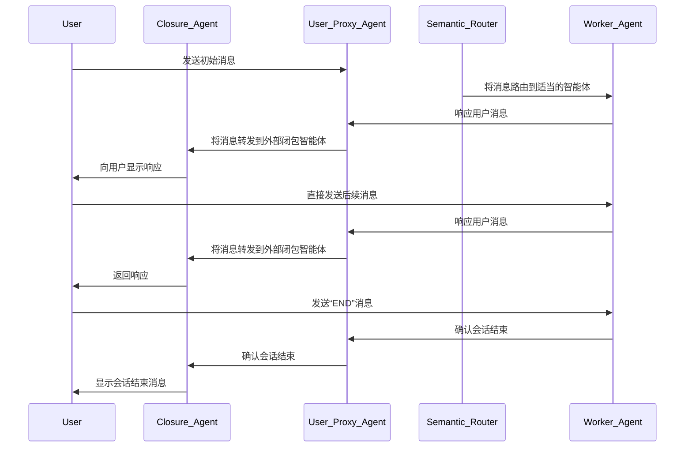

# **多智能体编排：分布式智能体运行时示例**

本仓库展示了如何运行一个分布式智能体运行时。该系统由三个主要组件组成：

1.  **智能体主机运行时 (Agent Host Runtime)**：负责管理事件引擎和发布/订阅消息系统。
2.  **工作运行时 (Worker Runtime)**：负责分布式智能体的生命周期，包括“语义路由器”。
3.  **用户代理 (User Proxy)**：负责管理用户界面以及用户与智能体之间的交互。

## **功能说明**

### **示例场景**

本示例提供了一个简单的场景，其中包含一组分布式智能体（一个“HR”智能体和一个“财务”智能体），企业可以使用它们来管理其人力资源和财务运营。这些智能体都是独立的，并且可以在不同的机器上运行。虽然许多多智能体系统旨在让智能体协作解决一个困难任务，但本示例的目标是展示企业如何管理大量适用于单个任务的智能体，以及如何将用户路由到最相关的智能体以处理当前任务。

该系统的设计方式是，当用户启动会话时，语义路由器智能体将识别用户的意图（目前使用过于简单的字符串匹配方法），识别最相关的智能体，然后将用户路由到该智能体。然后，该智能体将管理与用户的对话，用户将能够以对话方式与智能体进行交互。

尽管本示例中智能体的逻辑很简单，但其目标是展示 AutoGen 的分布式运行时能力如何独立于智能体本身的能力来支持此场景。

### **消息流**

利用智能体主机运行时的“主题”功能，系统的消息流如下所示：



## **安装**

### **1. 开始之前**

1.  安装 `autogen-core` 及其依赖项。

### **2. 运行**

由于本示例旨在演示分布式运行时，因此本示例的组件旨在在不同的进程中运行，即不同的终端。

在 2 个单独的终端中运行：

```bash
# 终端 1，运行智能体主机运行时
python run_host.py
```

```bash
# 终端 2，运行工作运行时
python run_semantic_router.py
```

第一个终端应记录一系列事件，其中各种智能体已注册到运行时。

在第二个终端中，您可以输入与财务或人力资源场景相关的请求。在本示例中，这意味着在您的请求中使用以下关键字之一：

*   对于财务智能体：“finance”、“money”、“budget”
*   对于人力资源智能体：“hr”、“human resources”、“employee”

然后，您将看到主机和工作运行时来回发送消息，路由到正确的智能体，然后打印最终响应。

然后，对话可以与选定的智能体继续进行，直到用户发送包含“END”的消息，此时智能体将与用户断开连接，并且可以开始新的对话。

### **贡献者**

- Diana Iftimie (@diftimieMSFT)
- Oscar Fimbres (@ofimbres)
- Taylor Rockey (@tarockey)
